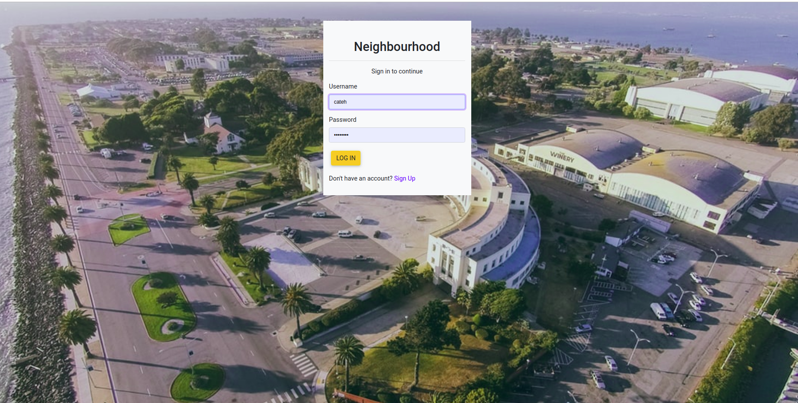
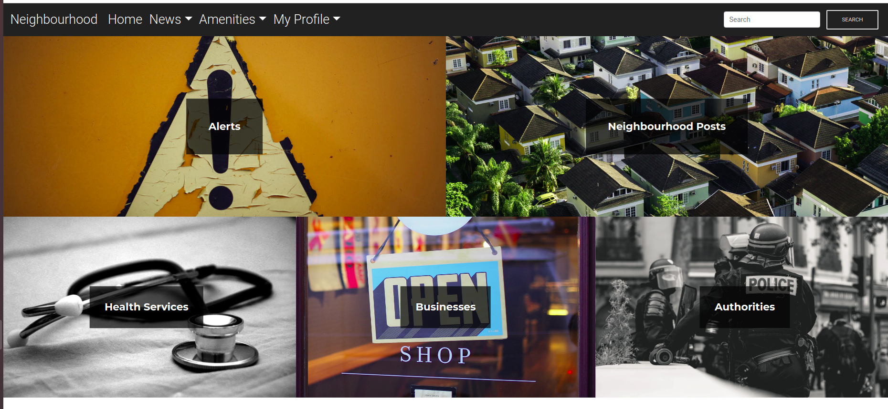

## PROJECT NAME 
- NEIGHBOURHOOD

## AUTHOR 
- CATHERINE NDUKU 

## DESCRIPTION 
- This is a web application allows you to be in the loop about everything happening in your neighborhood. From contact information of different handyman to meeting announcements or even alerts.

## Features

As a user of the web application you will be able to:

1. Sign up and log in

2. Choose your neighbourhood
3. View  posted alerts and post by other users from your neighbourhood
4. Post alerts and posts
5. Comment on a post
6. Edit your profile
7. See authorities and health services around

## BDD 

## Specifications
| Behavior            | Input                         | Output                        | 
| ------------------- | ----------------------------- | ----------------------------- |
| User visits the app and gets directed to the login page  | User logs in | Directed to the home page | 
If user has no account, they click on `sign up` | User signs up | User is redirected to the profile set up page |
|  Homepage loads | Click `alerts` | User's taken to the alerts page| 
| Homepage loads | Click `Neighbourhood Posts` | User's redirected to a page where they can see uploaded posts and a button to post too | 
| Homepage loads | Click `Health Services` | User's redirected to a page where they can see health services | 
| Homepage loads | Click `Businesses` | User's redirected to a page where they can see uploaded businesses |
| Homepage loads | Click `Authorities` | User's redirected to a page where they can see posted authorities in the same neighbourhood |
| Homepage loads | User inputs in the search form and presses enter | Searched results show |

